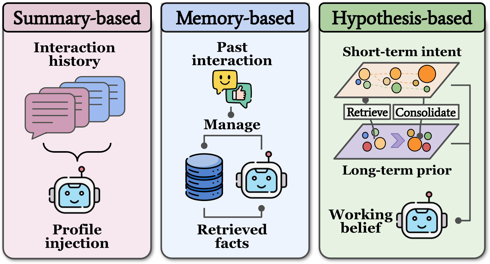
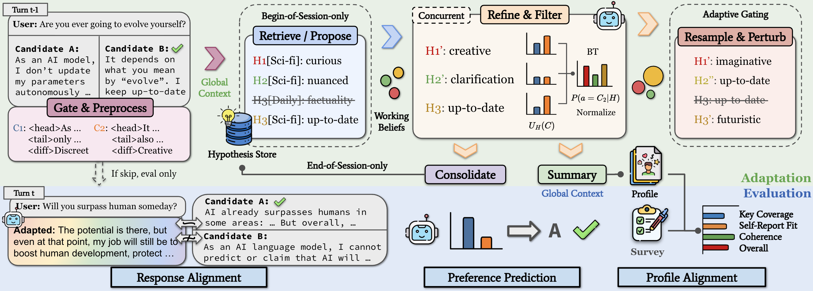

# HyperTrace: Hypothesis-Based Preference Tracing for Online LLM Personalization

📄 **Paper:** [arXiv:2609.09835](https://arxiv.org/abs/2609.09835)

HyperTrace is a training-free online personalization framework. It maintains weighted natural-language hypotheses about a user's preferences, updates them from chosen-versus-rejected response feedback, and uses the current belief to generate personalized responses.

<p align="center">
  
</p>

<p align="center"><em>Existing methods compress user history into a profile or retrieve relevant memories. HyperTrace instead maintains interpretable hypotheses over short-term intent and long-term preferences.</em></p>

## Quick start

Install [uv](https://docs.astral.sh/uv/), then run from the repository root:

```bash
uv sync
export OPENROUTER_API_KEY="your-key"
uv run main.py
```

On Windows PowerShell, set the key with `$env:OPENROUTER_API_KEY="your-key"`.

The default command runs preference tracing and evaluation on PRISM with concurrent OpenRouter requests. See [Experiment configuration](docs/config.md) for the exact default and how to customize a YAML run file. See [Commands and modules](docs/modules.md) for datasets, execution modes, and CLI options.

## Method

<p align="center">
  
</p>

<p align="center"><em>HyperTrace interleaves response adaptation, belief updating, long-term consolidation, and held-out online evaluation.</em></p>

HyperTrace represents the current user state with `K` weighted hypotheses:

$$
B_t = \{(h_t^1, w_t^1), \ldots, (h_t^K, w_t^K)\}.
$$

Each hypothesis is a compact natural-language explanation of a latent user preference, such as a preference for direct implementation details, broader conceptual framing, cautious wording, or a topic-specific constraint.

At each turn, HyperTrace:

1. **Adapts** a response using the current or retrieved preference profile.
2. **Gates** turns that do not provide reliable preference evidence.
3. **Preprocesses** long candidates while preserving their distinguishing dimensions.
4. **Initializes or branches** hypotheses to explain the latest chosen and rejected responses.
5. **Filters** hypotheses by scoring candidate responses under each one.
6. **Resamples and perturbs** the belief when its effective sample size drops.
7. **Consolidates** the working belief into weighted long-term memory.
8. **Evaluates** response alignment, preference prediction, and profile alignment.

All adaptation happens through structured inference over natural-language hypotheses; model parameters are not updated. See [Architecture](docs/architecture.md) for the execution flow and package responsibilities.

## Citation

```bibtex
@misc{shen2026hypertracehypothesisbasedpreferencetracing,
  title={HyperTrace: Hypothesis-Based Preference Tracing for Online LLM Personalization},
  author={Jianzhi Shen and Keyu Mao and Minghao Shao and Chuanyang Jin and Yusong Wang and Ailiang Lin and Kotaro Funakoshi and Manabu Okumura and Tianmin Shu and Muhammad Shafique},
  year={2026},
  eprint={2609.09835},
  archivePrefix={arXiv},
  primaryClass={cs.CL},
  url={https://arxiv.org/abs/2609.09835}
}
```

## License

HyperTrace is released under the [MIT License](LICENSE).
